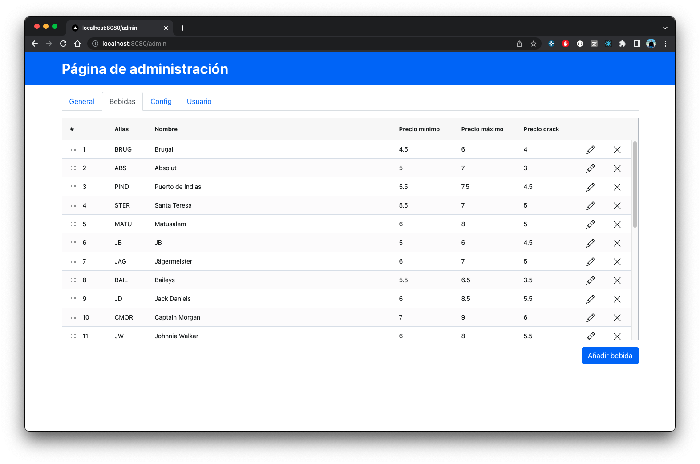
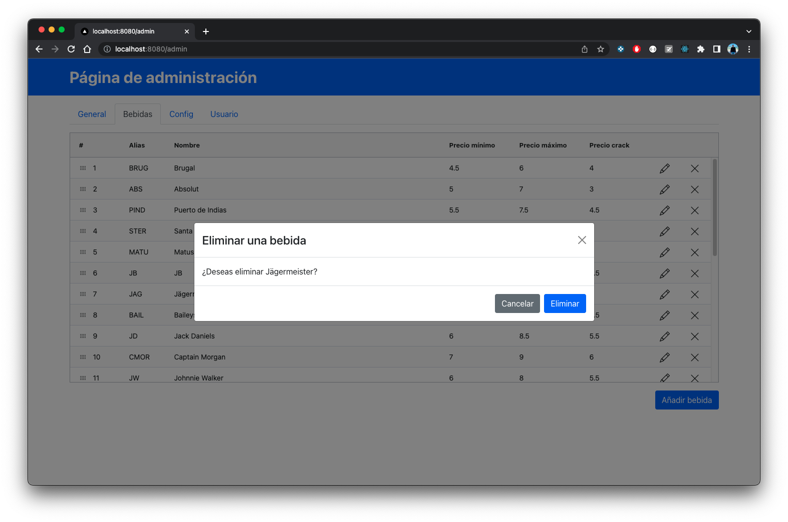
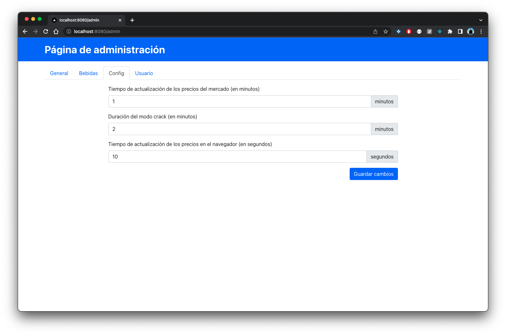
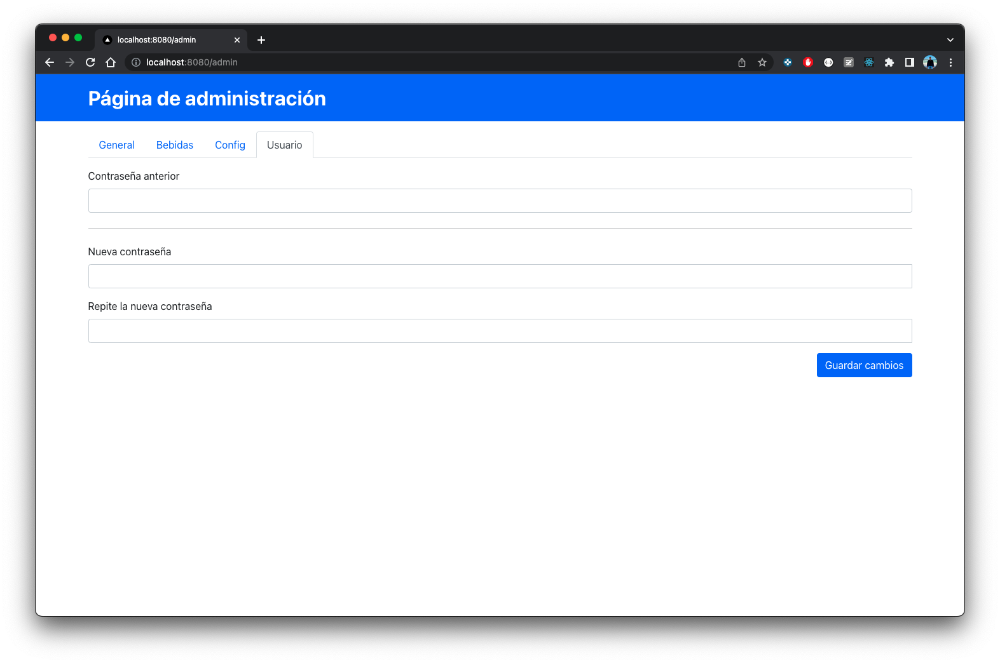

# La Bolsa

La Bolsa is a web application used in a pub called **La Bolsa** (_The Stock Change_) to show random prices for the drinks. The prices update automatically every 20 minutes between a minimum and a maximum price decided by the owner using an admin page. Prices go up or down using steps of 0.5€ to be easy to pay.

## Technical details
This proyect is built using the following technologies:
* Node.js v12.22.12.
* React v18.2.0.
* Next.js v12.2.0.
* React-Bootstrap v2.4.0.
* Log4js v6.6.1.
* SQLite3 v5.0.9.

The App uses SQLite3 to store and fetch the drink prices from a database. The update interval can be changed in the file **src/config/LaBolsa.js**.

## App Design

La Bolsa App is built with a responsive layout using bootstrap.


<p align = "center">
XXL desktop layout
</p>


<p align = "center">
MD desktop layout
</p>


<p align = "center">
XS desktop layout
</p>


<p align = "center">
Mobile layout
</p>

## Admin App Design


<p align = "center">
Admin Page
</p>


<p align = "center">
Drink list
</p>


<p align = "center">
Add drink modal
</p>


<p align = "center">
Edit drink modal
</p>


<p align = "center">
Delete drink modal
</p>


<p align = "center">
Admin config page
</p>


<p align = "center">
Update admin password
</p>


## Download the dependencies, create the database and run the development server
```bash
npm install
npm run create-db
npm run dev
```

The server will be started in the port 8080. This will be the URL: http://localhost:8080

The admin server page will be hosted on http://localhost:8080/admin. The user is **admin** and the default password is **admin**. The password can be changed in the admin dashboard.

## Run tests
There are some test that could be run using the following command:
```
npm test
```

## Build and run the production code
```bash
npm run build
npm run start
```

The server will be started in the port 8080. The URLs are the same as in development mode.